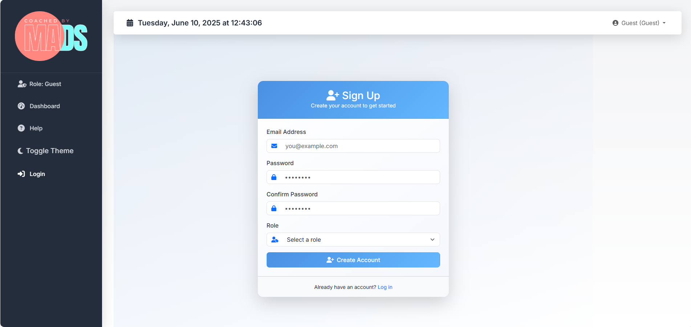
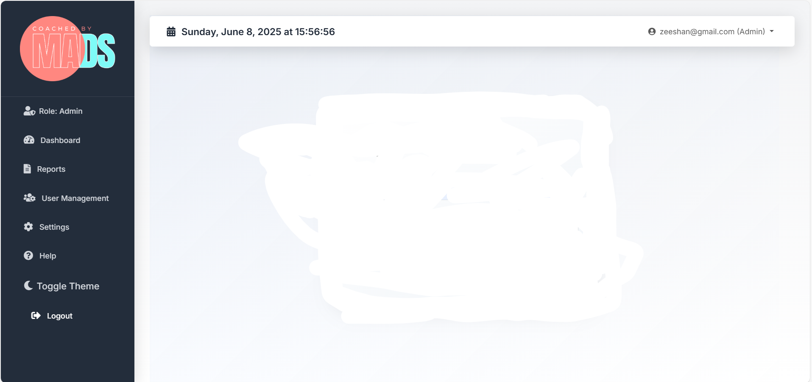
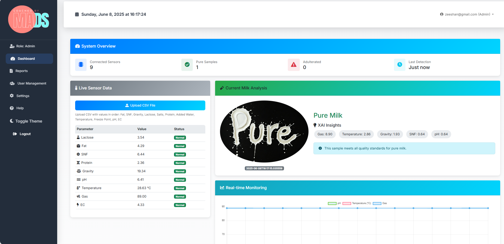
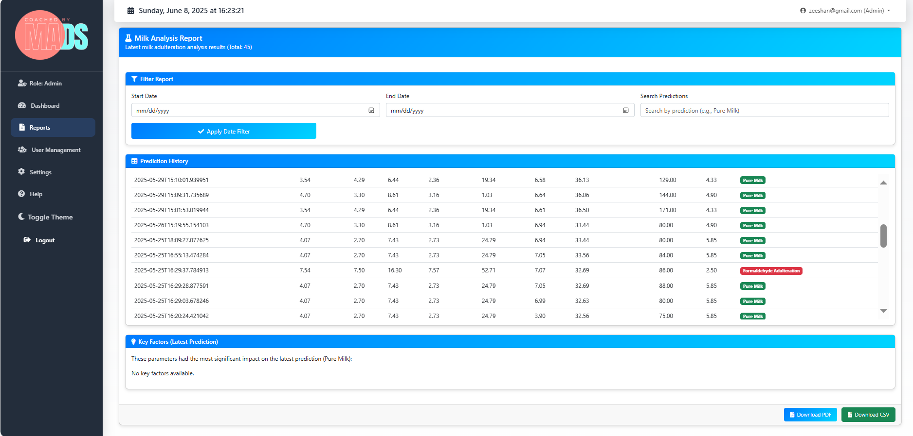
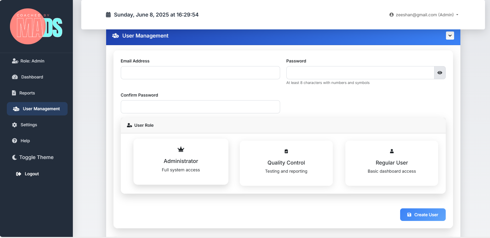
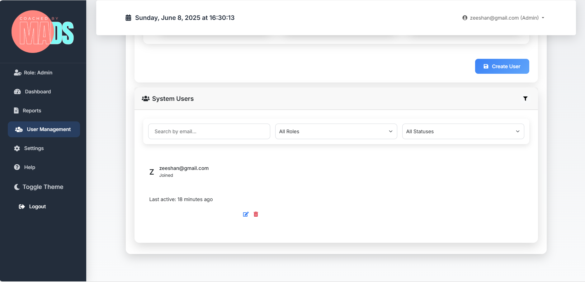
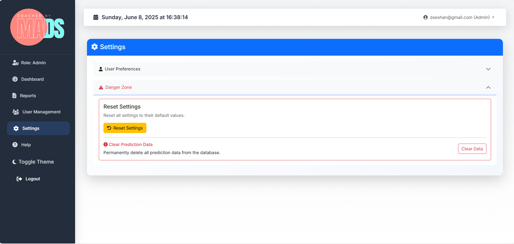
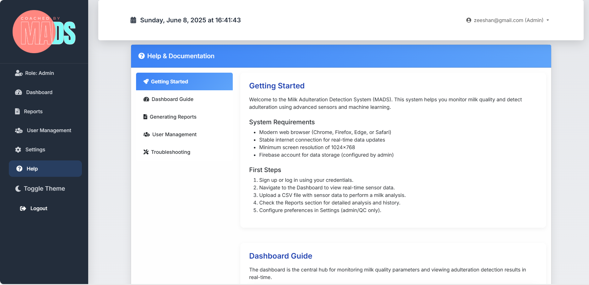
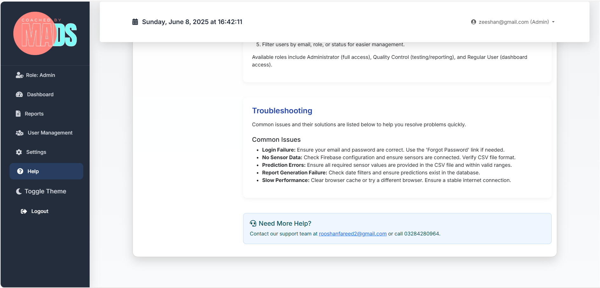

# **Milk Adulteration Detection System (MADS)**
The Milk Adulteration Detection System (MADS) is an innovative IoT and machine learning-based solution for real-time milk quality assessment, achieving 95% accuracy in detecting adulterants such as urea, starch, formaldehyde, sodium bicarbonate, and maltodextrin. Developed as a final year project, MADS addresses critical challenges in the dairy industry by providing a secure, scalable, and user-friendly platform for quality control.

# **Key Features**
## Real-Time Monitoring:
Utilizes ESP32-interfaced pH, temperature, and gas sensors to capture live milk quality data, updated every 5 seconds on a Django web dashboard.
## Advanced Analytics: 
Employs a Random Forest Classifier trained on a Kaggle dataset (4243 samples, 9 features: pH, temperature, gas, fat, SNF, protein, EC, lactose, gravity) for precise adulteration detection.
## Lactoscanner Integration: 
Processes USB-based CSV data from the Lactoscanner S60 (fat, SNF, protein, EC, lactose, gravity) to overcome RS232 communication challenges, using Pandas for preprocessing.
## Transparent Insights:
Leverages SHAP (SHapley Additive exPlanations) to highlight key features (e.g., EC, pH, lactose) driving predictions, enhancing trust in results.
## Multilingual Support: 
Features a Django dashboard with English and Urdu (Noto Nastaliq font) interfaces, ensuring accessibility for Pakistani dairy farmers.
## Secure Platform: 
Integrates Firebase Realtime Database for data storage and Firebase Authentication for role-based access (admin, quality control, user).
## Dynamic Visualizations:
Displays live sensor trends and prediction outcomes using Chart.js, with Bootstrap 5 for a responsive, user-friendly design.
# **Technologies Used**
## **Hardware:**
pH Sensor, Temperature Sensor, Gas Sensor, Lactoscanner S60, ESP32 Microcontroller, Arduino Uno.
## **Software:** 
Python 3.8+, Django 5.0, Firebase (Realtime Database, Authentication), Chart.js, Bootstrap 5, Jupyter Notebook.
## **Machine Learning:**
scikit-learn (Random Forest Classifier, StandardScaler), Pandas, NumPy, SHAP, joblib.
## **Additional:**
AJAX for asynchronous updates, Noto Nastaliq Urdu Font, StandardScaler for data normalization.
# **Project Highlights**
Achieves 95% accuracy in detecting five common milk adulterants, validated on a balanced Kaggle dataset.
Overcomes hardware limitations (e.g., RS232 garbage values) by implementing a USB-based CSV upload solution with Pandas preprocessing.
Provides a scalable framework for dairy quality assurance, with potential for mobile app development and expanded adulterant detection (e.g., melamine, detergents).
Supports Pakistan’s dairy industry with a multilingual interface and real-time insights, fostering consumer safety and industry trust.

